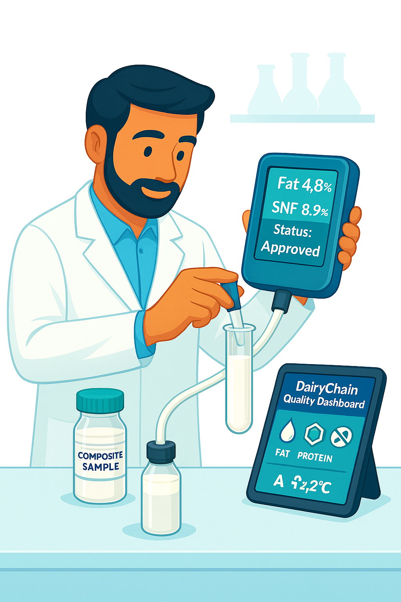

# ProGoDairy: Advanced Dairy Management & Supply Chain Suite

[](https://www.djangoproject.com/)
[](https://strawberry-graphql.ai/)
[](https://www.python.org/)
[](https://opensource.org/licenses/MIT)

**ProGoDairy** is a professional-grade, end-to-end dairy management solution built with Django. It streamlines the complex lifecycle of dairy operations—from initial milk collection at the farm level to quality testing, processing, and final distribution.

## 🚀 Project Overview

The dairy industry faces significant challenges in maintaining quality consistency, ensuring transparent pricing for farmers, and managing logistics across a distributed supply chain. **ProGoDairy** solves these problems by providing a centralized digital ecosystem that automates quality-based pricing, tracks real-time inventory, and manages multi-tier stakeholder relationships.

### The Problem it Solves
- **Quality Transparency**: Eliminates disputes by providing automated, parameter-based quality testing and pricing.
- **Operational Efficiency**: Replaces manual ledger-keeping with a digital workflow for collection and distribution.
- **Financial Accuracy**: Automates billing and payments based on complex quality-threshold bonuses.
- **Traceability**: Provides a complete audit trail of milk lots from the supplier to the processing plant.

---

## ✨ Key Features

### 🐄 Supplier & Farm Management
- **Digital Profiles**: Comprehensive management of supplier identities, banking details, and location data.
- **Capacity Forecasting**: Track daily capacity and annual projections to optimize collection routes.
- **Route Optimization**: Assign suppliers to specific collection routes for logistical efficiency.

### 🧪 Automated Quality Assurance
- **Multi-Parameter Tracking**: Real-time recording of Fat, Protein, SNF, Lactose, Bacterial Count, and MUN.
- **Smart Pricing Engine**: Dynamic price calculation based on configurable quality thresholds and bonuses.
- **Workflow Automation**: Integrated approval/rejection system for milk lots based on lab results.

### 🏭 Facility & Inventory Operations
- **Collection Centers**: Manage bulk coolers, tank assignments, and real-time inventory monitoring.
- **Processing Plants**: Coordinate between testers, plant managers, and distribution logistics.
- **Silo Management**: Track milk transfers into large-scale storage silos with automated logs.

### 🚛 Distribution & Logistics
- **Fleet Management**: Track vehicles, drivers, and gate passes for secure milk transit.
- **Transfer Logs**: Detailed tracking of milk movement between collection centers and processing units.
- **CIP Monitoring**: Digital logs for Cleaning-In-Place (CIP) to ensure hygiene compliance.

### 💰 Financial & Analytics
- **Automated Billing**: Generate professional invoices and payment bills in PDF format.
- **Dashboard Analytics**: Visual insights into collection volumes, quality metrics, and payment statuses.
- **GraphQL API**: Modern API layer for seamless integration with mobile apps or external services.

---

## 🛠️ Technology Stack

- **Backend**: [Django 5.2.4](https://www.djangoproject.com/) (Robust, Scalable Web Framework)
- **API Layer**: [Strawberry GraphQL](https://strawberry-graphql.ai/) (Flexible, Type-safe API)
- **Database**: SQLite (Default) / PostgreSQL & MySQL supported
- **Frontend**: Django Templates with JavaScript (Chart.js for analytics)
- **Task Management**: Django Admin (Advanced System Administration)

---

## 📁 Project Structure

```text
ProGoDairy/
├── accounts/          # User authentication and role-based access control
├── collection_center/ # Bulk cooler operations and center management
├── distribution/      # Logistics, vehicle tracking, and gate passes
├── milk/              # Core milk quality and pricing logic
├── plants/            # Processing plant operations and silo tracking
├── suppliers/         # Supplier profiles and milk lot lifecycle
├── static/            # CSS, JS, and high-quality UI assets
├── templates/         # Clean, modular HTML templates
└── dairy_project/     # Core system configuration and settings
```

---

## ⚙️ Installation & Setup

### Prerequisites
- Python 3.8+
- Virtual Environment tool (`venv` or `virtualenv`)

### Step-by-Step Installation

1. **Clone the Repository**
   ```bash
   git clone https://github.com/SOUGUR/ProGoDairy.git
   cd ProGoDairy
   ```

2. **Initialize Virtual Environment**
   ```bash
   python -m venv venv
   source venv/bin/activate  # Windows: venv\Scripts\activate
   ```

3. **Install Dependencies**
   ```bash
   pip install django==5.2.4 strawberry-graphql-django
   ```

4. **Database Setup**
   ```bash
   python manage.py makemigrations
   python manage.py migrate
   ```

5. **Create Administrator**
   ```bash
   python manage.py createsuperuser
   ```

---

## 🏃 Running the Application

Start the development server:
```bash
python manage.py runserver
```

- **Web Interface**: [http://127.0.0.1:8000/](http://127.0.0.1:8000/)
- **Admin Dashboard**: [http://127.0.0.1:8000/admin/](http://127.0.0.1:8000/admin/)
- **GraphQL Explorer**: [http://127.0.0.1:8000/graphql](http://127.0.0.1:8000/graphql)

---

## 📸 Screenshots (Placeholders)

> *Dashboard Overview - Visualizing daily collection and quality trends.*
> 

> *Supplier Management - Detailed view of farmer profiles and routes.*
> 

---

## 📈 Future Roadmap

- [ ] **Mobile Integration**: Dedicated Flutter/React Native app for field agents.
- [ ] **IoT Integration**: Real-time sensor data from bulk coolers (Temperature/Volume).
- [ ] **Advanced AI**: Predictive analytics for milk yield and spoilage risks.
- [ ] **Payment Gateway**: Integrated UPI/Bank transfers for instant supplier payouts.

---

## 📝 License & Contact

**License**: Distributed under the MIT License. See `LICENSE` for more information.

**Maintainer**: [SOUGUR](https://github.com/SOUGUR)  
**Project Link**: [https://github.com/SOUGUR/ProGoDairy](https://github.com/SOUGUR/ProGoDairy)

---
*Built with ❤️ for the Dairy Industry.*
